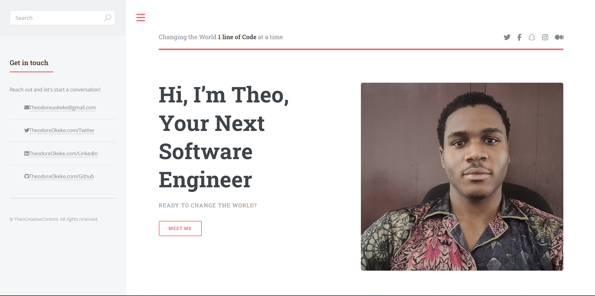

# Portfolio

## Technology Used 

| Technology Used         | Resource URL           | 
| ------------- |:-------------:| 
| HTML    | [https://developer.mozilla.org/en-US/docs/Web/HTML](https://developer.mozilla.org/en-US/docs/Web/HTML) | 
| CSS     | [https://developer.mozilla.org/en-US/docs/Web/CSS](https://developer.mozilla.org/en-US/docs/Web/CSS)      |   
| Git | [https://git-scm.com/](https://git-scm.com/)     |    

## Description 

[Visit the Deployed Site](https://youtu.be/BFyeuLhjcPY)
Hi! Here's my Portfolio where you can learn a bit about me!





## Learning Points 
It was a fun learning experience working with CSS and being able to design my very first Portfolio!


## Author Info

```md
### Theodore Okeke 


* [Portfolio](https://youtu.be/bHX54GCrDB4)
* [LinkedIn](https://www.linkedin.com/in/theodore-okeke/)
* [Github](https://github.com/TheoUO)
```

© 2023 edX Boot Camps LLC. Confidential and Proprietary. All Rights Reserved.